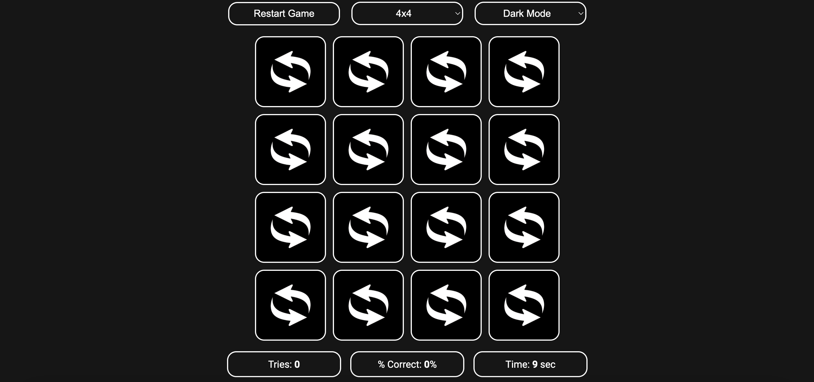
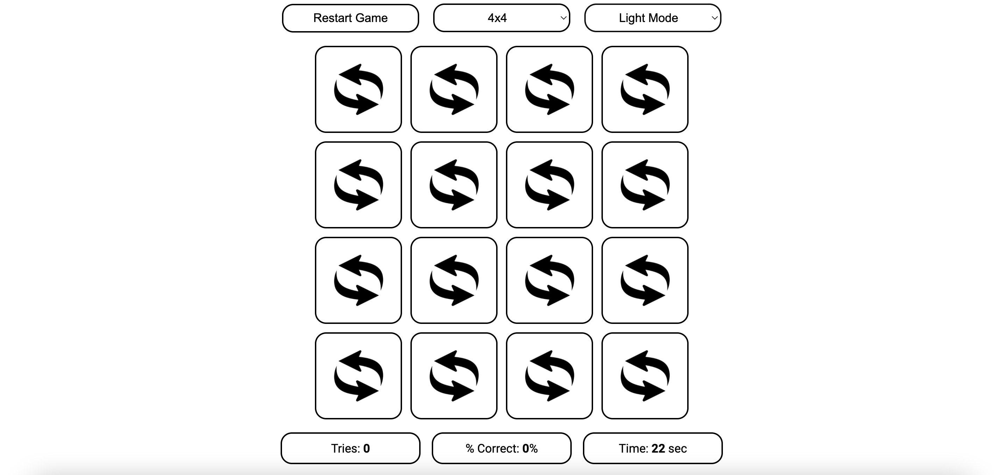

# Memory Flip
Memory Flip is a card matching game meant to test your memory & recall skills!  
You will be presented with a grid of cards (default 4x4), which you can flip over.  
Once you flip over two cards, they will be highlighted in green or red based on whether they match.  
There are also counters on the bottom of the page tracking your **tries** and **% correct**.  
You can switch between **2x2**, **4x4**, **6x6**, **8x8**, and **10x10** at the top of the page.  
You can also switch between dark and light modes. Scroll down to see how each theme looks.

### View website at https://zayndamji.github.io/memory-flip/
 

# Dark Mode

 

# Light Mode
